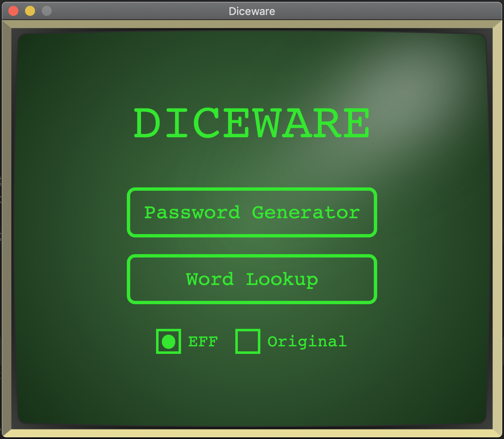
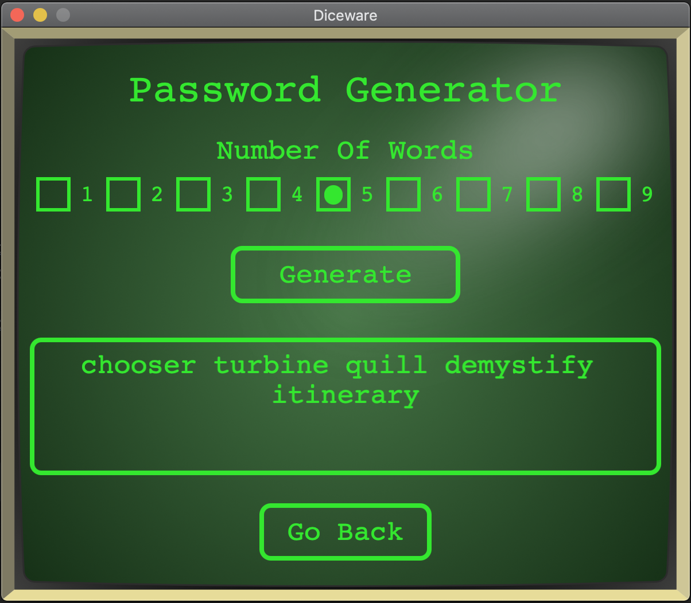
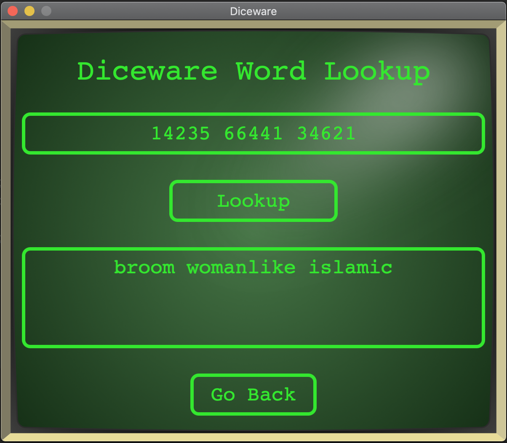

# Diceware Password Generator

Diceware™ is a method for picking passphrases that uses ordinary dice to select words at random from a special list called the Diceware Word List. Each word in the list is preceded by a five digit number. All the digits are between one and six, allowing you to use the outcomes of five dice rolls to select a word from the list.

[Read More About Diceware Here.](https://theworld.com/~reinhold/diceware.html)

Although Diceware purists will proclaim that one must use physical dice to generate their passphrase, this app uses a random number generator. For those purists, this app also provides a simple interface for translating a sequence of 5 digit numbers into Diceware words.

---

### Different Wordlists

On the start screen, the app allows the user to select between two different word lists that the passwords will be generated from. 

#### EFF

The Electronic Frontier Foundation new wordlist, created by [Joseph Bonneau](https://www.eff.org/about/staff/joseph-bonneau), aimed to fix some issues present in the original Diceware word list created by [Arnold G. Reinhold's](https://theworld.com/~reinhold/). 

[The EFF List](https://www.eff.org/files/2016/07/18/eff_large_wordlist.txt)

[Read more about the new EFF wordlist.](https://www.eff.org/deeplinks/2016/07/new-wordlists-random-passphrases)

#### Original 

The Diceware original wordlist that contains 7776 short words, abbreviations and easy-to-remember character strings. 

[The original list](https://theworld.com/~reinhold/diceware.wordlist.asc)

## Interface

	

	  
	  
	   
	

